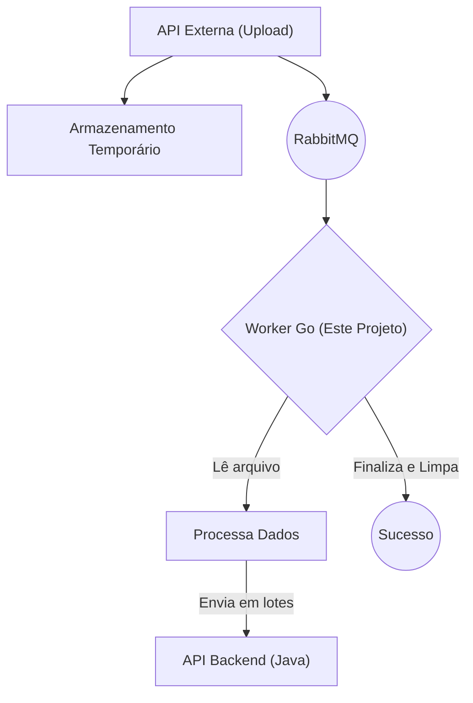

# Lottus Uploader - Serviço de Worker

Este projeto é um serviço de processamento de arquivos em Go, projetado para consumir trabalhos de uma fila RabbitMQ e cadastrar os dados em um serviço de backend. Ele foi desenvolvido para lidar com uploads de arquivos CSV ou XLSX de forma assíncrona e concorrente.

> **⚠️ Importante:** O escopo deste repositório é exclusivamente o **worker** (`worker/main.go`). A API de upload que recebe os arquivos e os publica na fila é um **serviço separado** e não faz parte deste projeto.

---

### **Aviso de Licença**

Este projeto é disponibilizado publicamente sob uma licença restritiva, destinada **exclusivamente para fins de consulta, estudo e aprendizado**.

*   **É proibido** redistribuir, republicar, ou utilizar este código (total ou parcialmente) em outros projetos, sejam eles acadêmicos ou comerciais.
*   **É proibido** modificar, adaptar ou criar obras derivadas a partir deste projeto.

Para mais detalhes, consulte o arquivo [LICENSE.md](LICENSE.md).

---

## Arquitetura e Fluxo de Trabalho

O sistema opera com base em uma arquitetura de produtor-consumidor, onde este projeto atua como o consumidor final.



1.  Um **serviço externo** (não incluído aqui) recebe o upload de um arquivo (`.csv` ou `.xlsx`).
2.  Este serviço salva o arquivo em um local de armazenamento temporário e publica uma mensagem na fila `upload_processamento_fila` do RabbitMQ. A mensagem contém o caminho absoluto para o arquivo e a "finalidade" (ex: "livros", "alunos").
3.  O **Worker Go** (`worker/main.go`) consome a mensagem da fila.
4.  Ele lê o arquivo correspondente, seja CSV ou XLSX, e processa seu conteúdo.
5.  Os dados são enviados de forma concorrente e em lotes para a API de backend em Java, respeitando limites de concorrência para otimizar a performance sem sobrecarregar o destino.
6.  Após o processamento bem-sucedido, a mensagem é confirmada (ACK) no RabbitMQ e o arquivo temporário é removido.

## Funcionalidades Principais

-   **Processamento Assíncrono:** Utiliza RabbitMQ para desacoplar o upload do processamento.
-   **Suporte a Múltiplos Formatos:** Lê e interpreta arquivos `.csv` e `.xlsx` de forma transparente.
-   **Concorrência Controlada:** Usa `goroutines` e canais para processar e enviar dados em paralelo, com limites configuráveis para não sobrecarregar a API de destino.
-   **Processamento em Lotes (Batch):** Envia os registros para a API de backend em lotes, melhorando a eficiência da rede.
-   **Resiliência:** Mensagens não processadas com sucesso podem ser rejeitadas e tratadas posteriormente.

## Como Executar

**Pré-requisitos:**
*   [Go](https://go.dev/doc/install) (versão 1.18 ou superior)
*   [Docker](https://docs.docker.com/get-docker/) e [Docker Compose](https://docs.docker.com/compose/install/)

**Passos:**

1.  **Iniciar a Infraestrutura:**
    O RabbitMQ é gerenciado via Docker Compose. Para iniciá-lo, execute:
    ```sh
    docker-compose up -d
    ```

2.  **Executar o Worker:**
    Navegue até o diretório do worker e execute o `main.go`.
    ```sh
    cd worker
    go run main.go
    ```
    O worker se conectará ao RabbitMQ e começará a aguardar por mensagens para processar.

## Configuração

As principais configurações do worker estão definidas como constantes no arquivo `worker/main.go`:

-   `rabbitMQURL`: URL de conexão com o RabbitMQ.
-   `queueName`: Nome da fila a ser consumida.
-   `storagePath`: **Caminho base onde o serviço de upload (externo) armazena os arquivos**. O worker usa essa referência para encontrar os arquivos.
-   `max...Workers`: Controlam o número de requisições simultâneas para cada tipo de entidade (ex: `maxLivroWorkers`, `maxAlunoWorkers`), permitindo o ajuste fino da performance.
-   `java...Endpoint`: Endereços dos endpoints da API Java de backend.

## Estrutura do Projeto

```
.
├── docker-compose.yml      # Define o serviço do RabbitMQ.
├── go.mod / go.sum         # Dependências do projeto Go.
├── LICENSE.md              # Licença de uso.
├── main.go                 # (OBSOLETO) Código do antigo serviço de API, movido para outro projeto.
├── README.md               # Este arquivo.
└── worker/
    ├── main.go             # Lógica principal do worker: consumidor da fila e processador de arquivos.
    └── .env                # (Opcional) Pode ser usado para variáveis de ambiente.
```

-   **`main.go` (obsoleto):** Este arquivo continha a API de upload, mas foi descontinuado e movido para um serviço separado. **Não deve ser utilizado**.
-   **`uploads_temp/` (externo):** Este diretório, mencionado no código antigo, **não é utilizado neste projeto**. Ele pertence ao serviço de upload, que é responsável por gerenciar o armazenamento temporário.

## Licença

Este projeto é distribuído sob os termos da licença especificada no arquivo `LICENSE.md`.
